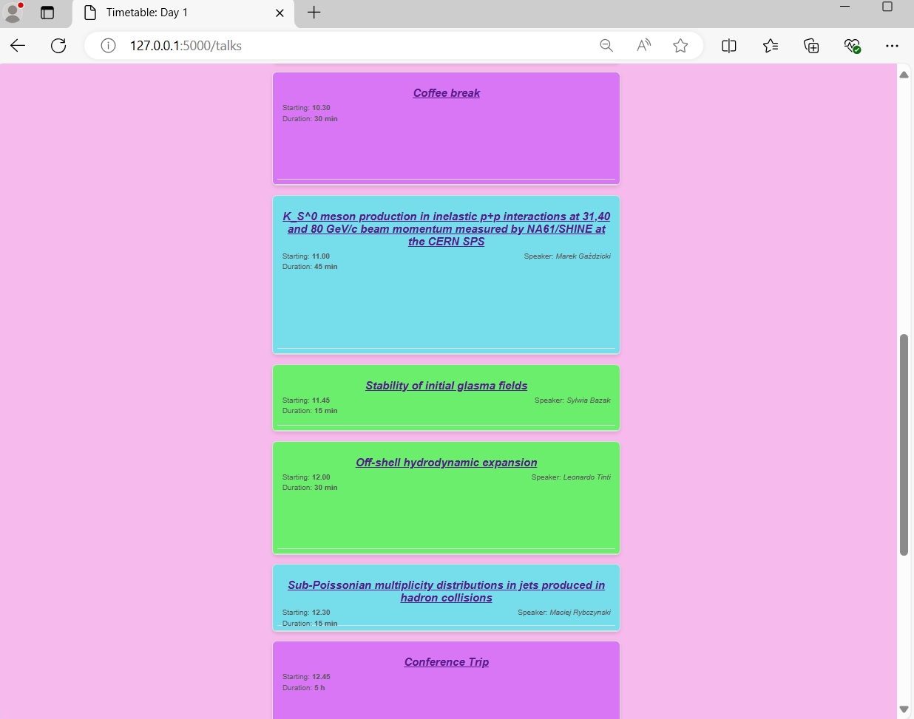
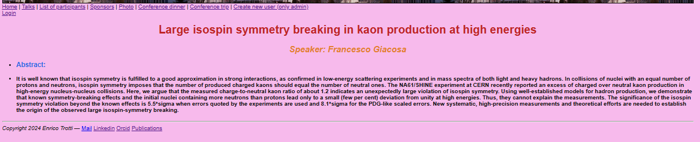
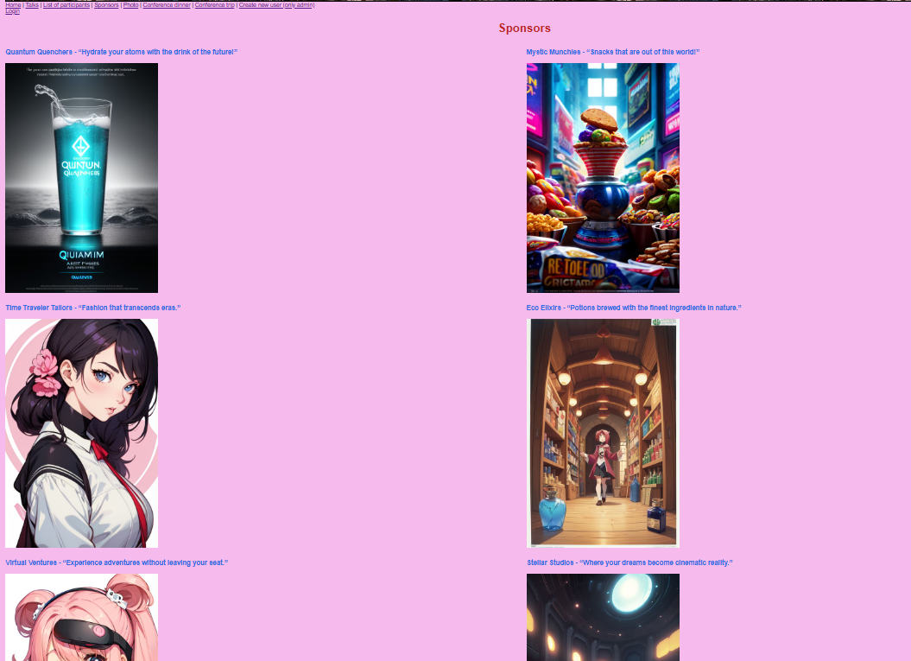
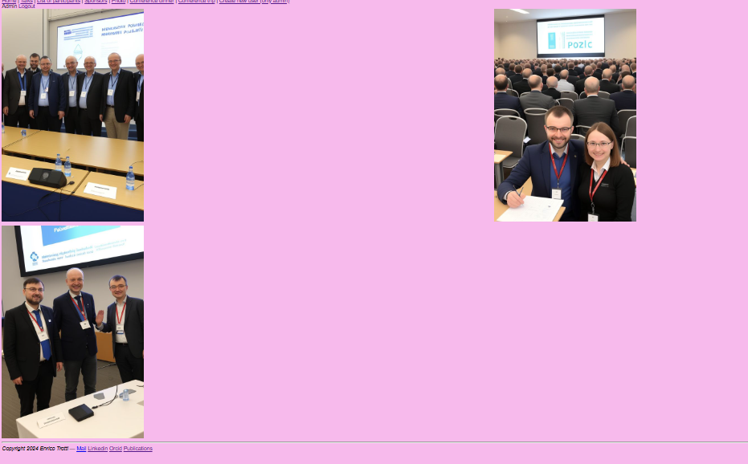
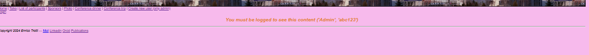
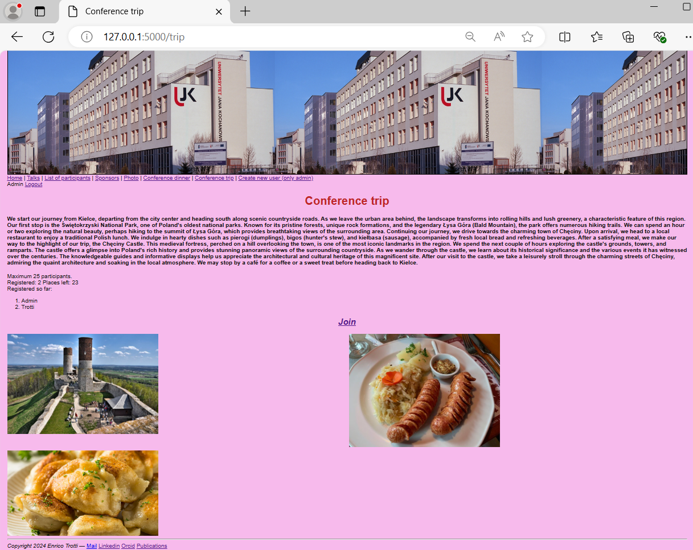

# Flask_project
Flask project of a hypothetical conference, done using an external database. \
Here are the main features of the app:\

There is a page of the timetables, with the 
 in different colors and sizes according to the type of talk and the duration. \
\
If you click on the title you can access the info of the talks.\
\
The sponsors and the Conference photo are AI generated. \
 \
You can access the photos only if you are logged in, and you can create new user only if you are logged in as Admin. \
\
You can also join the conference trip if you are logged in, up to 25 places. There is also a countdown counting the places left for the trip.\
\

